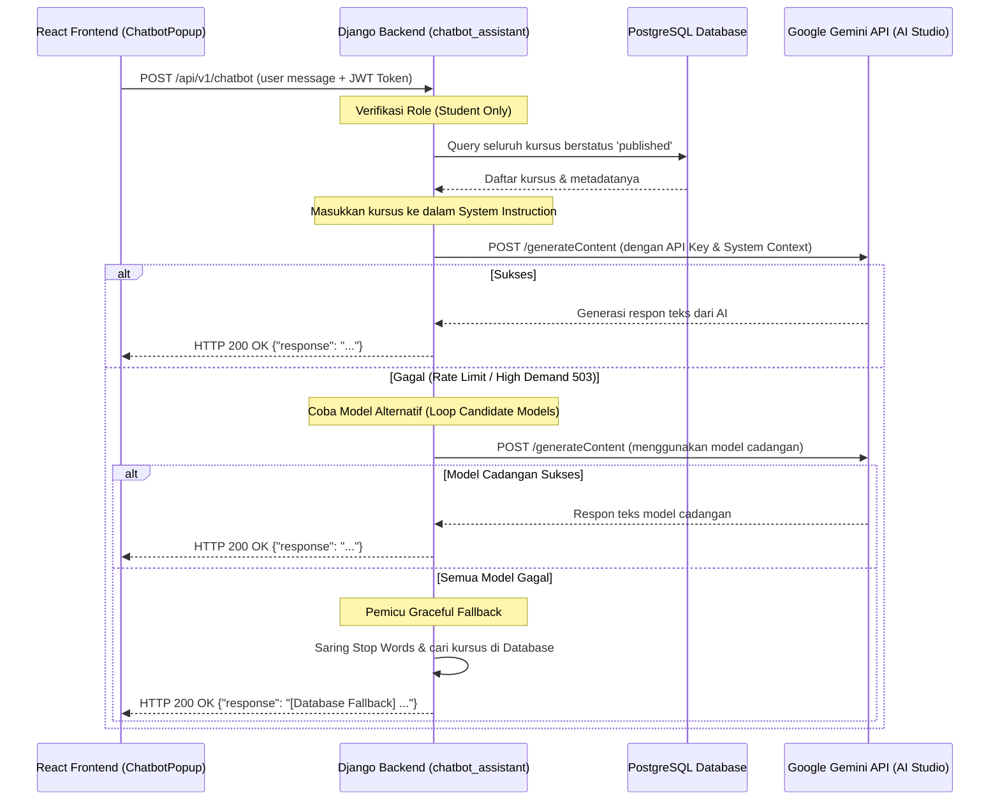

# FINAL PROJECT REPORT
## Simple LMS Extended Backend

---

## Identitas
- **Nama**: Sabrina Aska Amalina
- **NIM**: A11.2023.15264
- **Kelas**: A11.54403 — Pemrograman Sisi Server
- **URL Repository**: https://github.com/sabrinaskaa/BE-Simple-LMS
- **Deployment Link**: https://fe-simple-lms.vercel.app/

---

## Deskripsi Project

Project **Simple LMS Extended Backend** adalah REST API untuk sistem Learning Management System (LMS) sederhana yang dibangun menggunakan Django 5.1 dan Django Ninja. Sistem ini mendukung autentikasi berbasis JWT, manajemen course dan konten, enrollment mahasiswa, upload file, serta task asinkron melalui Celery dan RabbitMQ.

Tech stack yang digunakan mencerminkan arsitektur **polyglot persistence**: PostgreSQL 16 untuk data transaksional utama (users, courses, enrollments, reviews, progress), Redis 7 untuk caching course list/detail dan rate limiting request, serta MongoDB 7 untuk menyimpan activity logs dan analytics data dengan skema fleksibel dan performa tulis tinggi.

Untuk Paket 1 (LMS Experience), project ini mengimplementasikan fitur advanced search/filter/sorting, sistem rating & review, wishlist, kurikulum berbasis section, progress belajar detail per-lesson, dan student dashboard terintegrasi dengan Redis cache. Semua endpoint bisa diuji langsung melalui Swagger UI di `http://localhost:8000/api/v1/docs`.

---

## Fitur Dasar yang Sudah Berjalan

| Fitur | Status |
|-------|--------|
| Docker Compose (semua service) | ✅ Selesai |
| PostgreSQL + migrasi | ✅ Selesai |
| JWT Authentication (login, register, refresh, me) | ✅ Selesai |
| Role-Based Access Control (Admin, Instructor, Student) | ✅ Selesai |
| Course API (CRUD) | ✅ Selesai |
| Category API (CRUD) | ✅ Selesai |
| Lesson/Content API (CRUD) | ✅ Selesai |
| Enrollment & Progress dasar | ✅ Selesai |
| File Upload / Download | ✅ Selesai |
| Async Task via Celery (export report, update stats) | ✅ Selesai |
| Task status endpoint | ✅ Selesai |
| Celery Beat scheduler | ✅ Selesai |
| Flower monitoring | ✅ Selesai |
| MongoDB activity logs (reports) | ✅ Selesai |
| MongoDB analytics (analytics app) | ✅ Selesai |
| Swagger/OpenAPI docs | ✅ Selesai |
| Redis caching + rate limiting | ✅ Selesai |
| Publishing Workflow (submit → review → approve/reject) | ✅ Selesai |
| Course Prerequisites (validasi enrollment) | ✅ Selesai |
| Student Chatbot Assistant (Gemini LLM) | ✅ Selesai |
| API Versioning (v1 & v2) | ✅ Selesai |
| Database & Cache Benchmarking | ✅ Selesai |
| Quizzes & Assessments | ✅ Selesai |
| Comments & Discussions | ✅ Selesai |
| Learning Map Endpoint | ✅ Selesai |
| Advanced Analytics CRUD (Admin) | ✅ Selesai |


---

## Fitur Tambahan yang Dipilih — Paket 1: LMS Experience

| No | Fitur                            |
|----|----------------------------------|
| 1 | Search, filter, dan sorting course lanjutan |
| 2 | Rating, review, dan wishlist course |
| 3 | Curriculum dan progress belajar detail |
| 4 | Student dashboard |
| 5 | Publishing Workflow |
| 6 | Course Prerequisites |

## Fitur Backend Tambahan (Implementasi Lanjutan)

| No | Fitur | Deskripsi Singkat |
|----|-------|-------------------|
| 1 | Student Chatbot Assistant (Gemini LLM) | AI Chatbot interaktif terintegrasi Google Gemini API (`gemini-flash-latest`) untuk menjawab pertanyaan siswa dan merekomendasikan kursus berdasarkan database sistem. |
| 2 | API Versioning & Multiple Routers | Pemisahan endpoint ke dalam namespace `v1` dan `v2` secara paralel tanpa merusak kompatibilitas client lama. |
| 3 | Profiling & Benchmarking | Command Django kustom (`benchmark_lms`, `benchmark_mongo`) untuk membuktikan optimasi jumlah query PostgreSQL dan performa Redis caching. |


---

## Penjelasan Implementasi Fitur Tambahan

### 1. Search, Filter, dan Sorting Course Lanjutan

Endpoint `GET /api/v1/courses` mendukung semua parameter yang diminta rubrik. Implementasi terbaru memakai `CourseFilter(FilterSchema)` dari Django Ninja untuk filtering deklaratif. Field `search` dipetakan ke `name__icontains` dan `description__icontains`, sedangkan `instructor_id`, `min_price`, dan `max_price` memakai custom filter method berbasis `Q()` agar tetap aman. Filter kosong/tidak diisi tidak akan mengakibatkan error karena `FilterSchema` mengembalikan kondisi kosong untuk nilai yang tidak dikirim.

- **Search**: `CourseFilter.search` dengan `Field(q=["name__icontains", "description__icontains"])`
- **Filter**: `CourseFilter(FilterSchema)` untuk `category_id`, `instructor_id` (teacher_id), `level`, `status`, `min_price`, `max_price`
- **Sorting**: `ordering` dari whitelist `{name, -name, price, -price, created_at, -created_at, rating_avg, -rating_avg}`
- **Validasi**: level/status yang tidak valid langsung return `400 Bad Request`
- **Pagination**: `page`, `page_size` dengan metadata `total`, `page`, `page_size`
- **Cache**: Setiap kombinasi parameter di-cache di Redis dengan TTL 5 menit menggunakan composite cache key

**Contoh penggunaan:**
```
GET /api/v1/courses?search=python&level=beginner&status=published&ordering=-rating_avg&page=1&page_size=10
GET /api/v1/courses?category_id=1&min_price=0&max_price=200000&ordering=-rating_avg
GET /api/v1/courses?instructor_id=3&ordering=price&page=2&page_size=5
```

---

### 2. Rating, Review, dan Wishlist

**Review Flow:**
- Model `CourseReview` memiliki `unique_together = ("course", "user")` sehingga satu user hanya bisa punya satu review per course
- `POST /courses/{id}/reviews` menggunakan `update_or_create()` sehingga bisa membuat atau memperbarui review dalam satu endpoint
- Guard: dicek dahulu apakah user sudah enroll (`CourseMember` exists), jika tidak → `403 Forbidden`
- Validasi: rating harus integer 1–5, jika di luar range → `400 Bad Request`
- Setiap kali review dibuat atau dihapus, `rating_avg` dan `total_reviews` di model `Course` langsung dihitung ulang menggunakan `.aggregate(avg=Avg("rating"), total=Count("id"))` dan disimpan
- Cache course detail di-invalidate setiap kali rating berubah

**Wishlist:**
- Model `Wishlist` dengan `unique_together = ("user", "course")` — duplikat → `409 Conflict`
- `POST /wishlist`, `GET /wishlist` (paginated), `DELETE /wishlist/{course_id}`
- Setiap perubahan wishlist men-invalidate dashboard cache user tersebut

**Contoh flow review:**
1. Student login → dapatkan token
2. Student enroll ke course (`POST /enrollments`)
3. Student `POST /courses/{id}/reviews` dengan `{"rating": 5, "review": "Keren!"}`
4. Sistem hitung ulang `rating_avg` → simpan ke `Course.rating_avg`
5. `GET /courses/{id}/reviews` → tampilkan semua review + `rating_avg`

---

### 3. Curriculum dan Progress Belajar Detail

**Model CourseSection** (`models.py` baris 132–149):
- FK ke `Course`, memiliki `title`, `order`, `created_at`
- `ordering = ["course", "order"]` untuk urutan konsisten

**Relasi ke CourseContent:**
- Field `section` (FK ke CourseSection, nullable) di model `CourseContent`
- Field `order` untuk urutan lesson dalam section

**Section CRUD:**
- `POST /courses/{id}/sections` — buat section (Owner/Admin)
- `GET /courses/{id}/sections` — list sections dengan daftar lesson di dalamnya (public)
- `PATCH /courses/{id}/sections/{section_id}` — update (Owner/Admin)
- `DELETE /courses/{id}/sections/{section_id}` — hapus (Owner/Admin)

**Progress Detail (`GET /enrollments/{id}/progress`):**
Response mencakup per-section breakdown dengan daftar lesson dan `is_completed` per lesson:

```json
{
  "total_lessons": 5,
  "completed_lessons": 3,
  "progress_percent": 60.0,
  "sections": [
    {
      "section_id": 1,
      "section_title": "Pendahuluan",
      "total_lessons": 2,
      "completed_lessons": 2,
      "progress_percent": 100.0,
      "lessons": [
        {"lesson_id": 1, "title": "Intro", "is_completed": true},
        {"lesson_id": 2, "title": "Setup", "is_completed": true}
      ]
    },
    {
      "section_id": 2,
      "section_title": "Materi Inti",
      "total_lessons": 3,
      "completed_lessons": 1,
      "progress_percent": 33.33,
      "lessons": [
        {"lesson_id": 3, "title": "Bab 1", "is_completed": true},
        {"lesson_id": 4, "title": "Bab 2", "is_completed": false},
        {"lesson_id": 5, "title": "Bab 3", "is_completed": false}
      ]
    }
  ]
}
```

Progress = 100% **hanya** jika `completed_lessons == total_lessons > 0`.

---

### 4. Student Dashboard

Endpoint `GET /api/v1/dashboard/student` (Auth required) mengembalikan ringkasan lengkap:

```json
{
  "active_courses": [
    {
      "course_id": 2,
      "course_name": "Pemrograman Web",
      "progress_percent": 60.0,
      "total_lessons": 5,
      "completed_lessons": 3,
      "instructor_name": "Budi Santoso"
    }
  ],
  "completed_courses": [
    {
      "course_id": 1,
      "course_name": "Basis Data",
      "progress_percent": 100.0,
      "total_lessons": 3,
      "completed_lessons": 3,
      "instructor_name": "Siti Wijaya"
    }
  ],
  "total_enrolled": 2,
  "total_completed": 1,
  "wishlist_count": 3,
  "wishlist": [
    {
      "course_id": 5,
      "course_name": "Kecerdasan Buatan",
      "rating_avg": "4.50",
      "price": 150000,
      "instructor_name": "Ahmad Kusuma"
    }
  ],
  "recommended_courses": [
    {
      "id": 8,
      "name": "Data Mining",
      "rating_avg": "4.80",
      "total_reviews": 42,
      "price": 200000,
      "instructor_name": "Dewi Rahayu",
      "reason": "Populer di kategori yang sama"
    }
  ]
}
```

**Logika rekomendasi**: Diambil top-5 course dengan rating tertinggi yang belum di-enroll. Jika user sudah enroll di course dengan kategori tertentu, prioritaskan course dari kategori yang sama. Reason field menjelaskan dasar rekomendasi.

**Cache Redis**: Data dashboard di-cache dengan key `dashboard:student:{user_id}` TTL 3 menit. Cache di-invalidate saat: enroll baru, progress diupdate, atau wishlist diubah.

---

## Cara Menjalankan Project

```bash
# 1. Clone repository
git clone https://github.com/sabrinaskaa/BE-Simple-LMS
cd BE-Simple-LMS

# 2. Salin konfigurasi environment
cp .env.example .env

# 3. Jalankan semua service
docker compose up -d

# 4. Tunggu hingga app siap, lalu jalankan seed data
docker compose exec app python manage.py seed_data

# 5. Verifikasi
# - Swagger UI   : http://localhost:8000/api/v1/docs
# - Django Admin : http://localhost:8000/admin/
# - RabbitMQ UI  : http://localhost:15672 (admin/password123)
# - Flower UI    : http://localhost:5555
```

---

## Akun Demo

| Role | Username | Password |
|------|----------|----------|
| Admin | `admin` | `admin123` |
| Instructor | `dosen01` | `password123` |
| Instructor | `dosen02` | `password123` |
| Student | `mhs001` | `password123` |
| Student | `mhs002` | `password123` |

---

## Endpoint Penting untuk Pengujian Paket 1

### Authentication (dapatkan token dulu)
```
POST /api/v1/auth/login
Body: {"username": "mhs001", "password": "password123"}
```

### Fitur 1 — Search/Filter/Sorting
```
GET /api/v1/courses?search=python
GET /api/v1/courses?level=beginner&status=published
GET /api/v1/courses?category_id=1&ordering=-rating_avg
GET /api/v1/courses?min_price=0&max_price=500000&page=1&page_size=5
GET /api/v1/courses?ordering=-rating_avg&status=published
```

### Fitur 2 — Review
```
POST /api/v1/courses/{id}/reviews        [Auth: Student yang sudah enroll]
GET  /api/v1/courses/{id}/reviews        [Public]
DELETE /api/v1/courses/{id}/reviews/{review_id}  [Auth: Admin/Owner review]
```

### Fitur 2 — Wishlist
```
GET    /api/v1/wishlist                  [Auth: Login]
POST   /api/v1/wishlist                  [Auth: Login]
DELETE /api/v1/wishlist/{course_id}      [Auth: Login]
```

### Fitur 3 — Sections
```
GET    /api/v1/courses/{id}/sections             [Public]
POST   /api/v1/courses/{id}/sections             [Auth: Owner/Admin]
PATCH  /api/v1/courses/{id}/sections/{section_id} [Auth: Owner/Admin]
DELETE /api/v1/courses/{id}/sections/{section_id} [Auth: Owner/Admin]
```

### Fitur 3 — Progress Detail
```
POST /api/v1/enrollments/{id}/progress   [Auth: Student]
GET  /api/v1/enrollments/{id}/progress   [Auth: Student/Admin]
```

### Fitur 4 — Student Dashboard
```
GET /api/v1/dashboard/student            [Auth: Login]
```


### Fitur 5 — Quizzes & Comments
```
GET    /api/v1/courses/{id}/quizzes
POST   /api/v1/courses/{id}/quizzes
POST   /api/v1/quizzes/{quiz_id}/attempts/{attempt_id}/submit
GET    /api/v1/comments/?content_id={id}
POST   /api/v1/comments/
```

### Fitur 7 — Student Chatbot Assistant (Gemini LLM)
```
POST /api/v1/chatbot                     [Auth: Student]
Body: {"message": "Rekomendasikan saya kelas python"}
```

---

## Error Cases yang Dihandle

| Skenario | HTTP Status | Response |
|----------|-------------|----------|
| Review tanpa enroll | 403 | `{"detail": "Harus enroll ke course ini untuk memberikan review"}` |
| Rating di luar 1–5 | 400 | `{"detail": "Rating harus antara 1 dan 5"}` |
| Level filter tidak valid | 400 | `{"detail": "Level tidak valid. Pilih: beginner, intermediate, advanced"}` |
| Status filter tidak valid | 400 | `{"detail": "Status tidak valid. Pilih: draft, pending_review, published, archived"}` |
| Wishlist duplikat | 409 | `{"detail": "Kamu sudah menambahkan course ini ke wishlist"}` |
| Progress enrollment orang lain | 403 | `{"detail": "Anda tidak boleh mengubah progress enrollment milik user lain"}` |
| Course tidak ditemukan | 404 | `{"detail": "Course tidak ditemukan"}` |
| Instructor langsung set `published` | 400 | `{"detail": "Instructor tidak bisa langsung mempublikasikan course..."}` |
| Submit review saat `pending_review` | 400 | `{"detail": "Course sudah dalam status pending_review. Tunggu keputusan admin."}` |
| Enroll tanpa selesai prerequisite | 403 | `{"detail": "Kamu belum menyelesaikan semua prasyarat: ..."}` |
| Prerequisite circular dependency | 400 | `{"detail": "Menambah '...' sebagai prerequisite akan membuat circular dependency"}` |
| Prerequisite duplikat | 409 | `{"detail": "'...' sudah menjadi prerequisite course ini"}` |
| Chatbot pesan kosong | 400 | `{"detail": "Pesan tidak boleh kosong"}` |
| Chatbot diakses non-student | 403 | `{"detail": "Hanya student yang boleh mengakses endpoint ini"}` |

---

## Hasil Testing

Test suite dijalankan dengan perintah:

```bash
docker compose exec app python manage.py test courses --verbosity=2
```

### Modul Test dan Jumlah Test Case

| Modul | File | Jumlah Test | Coverage |
|-------|------|-------------|----------|
| Authentication | `test_auth.py` | 14 test | Register, Login, Refresh, GET/PUT /me |
| Fitur LMS | `test_courses.py` | 18 test | Search/Filter, Review, Wishlist, Progress, Dashboard |
| Permission/RBAC | `test_permissions.py` | 17 test | Create/Update/Delete per role, Enrollment |
| **Total** | | **49 test** | |

### Hasil Eksekusi

```
System check identified no issues (0 silenced).

# --- test_auth.py ---
test_get_me_dengan_token_valid (courses.test_auth.AuthMeTest) ... ok
test_get_me_tanpa_token (courses.test_auth.AuthMeTest) ... ok
test_update_me_email_duplikat_ditolak (courses.test_auth.AuthMeTest) ... ok
test_update_me_sukses (courses.test_auth.AuthMeTest) ... ok
test_register_email_duplikat (courses.test_auth.AuthRegisterTest) ... ok
test_register_otomatis_jadi_student (courses.test_auth.AuthRegisterTest) ... ok
test_register_sukses (courses.test_auth.AuthRegisterTest) ... ok
test_register_username_duplikat (courses.test_auth.AuthRegisterTest) ... ok
... (output dipersingkat)
test_login_sukses (courses.test_auth.AuthLoginTest) ... ok

----------------------------------------------------------------------
Ran 88 tests in 131.430s

OK
test_login_user_tidak_ada (courses.test_auth.AuthLoginTest) ... ok
test_refresh_dengan_access_token_ditolak (courses.test_auth.AuthRefreshTokenTest) ... ok
test_refresh_dengan_token_tidak_valid (courses.test_auth.AuthRefreshTokenTest) ... ok
test_refresh_menghasilkan_access_token_baru (courses.test_auth.AuthRefreshTokenTest) ... ok

# --- test_courses.py ---
test_buat_review_sukses (courses.test_courses.CourseReviewTest) ... ok
test_get_reviews_course (courses.test_courses.CourseReviewTest) ... ok
test_rating_di_luar_range_ditolak (courses.test_courses.CourseReviewTest) ... ok
test_review_tanpa_enroll_ditolak (courses.test_courses.CourseReviewTest) ... ok
test_review_update_rating_avg_course (courses.test_courses.CourseReviewTest) ... ok
test_filter_by_category_id (courses.test_courses.CourseSearchFilterTest) ... ok
test_filter_by_level_beginner (courses.test_courses.CourseSearchFilterTest) ... ok
test_filter_by_price_range (courses.test_courses.CourseSearchFilterTest) ... ok
test_filter_by_status_published (courses.test_courses.CourseSearchFilterTest) ... ok
test_filter_level_tidak_valid_return_400 (courses.test_courses.CourseSearchFilterTest) ... ok
test_list_courses_default (courses.test_courses.CourseSearchFilterTest) ... ok
test_pagination_page_dan_page_size (courses.test_courses.CourseSearchFilterTest) ... ok
test_search_course_by_name (courses.test_courses.CourseSearchFilterTest) ... ok
test_sorting_by_price_ascending (courses.test_courses.CourseSearchFilterTest) ... ok
test_sorting_by_price_descending (courses.test_courses.CourseSearchFilterTest) ... ok
test_dashboard_menampilkan_course_yang_diikuti (courses.test_courses.StudentDashboardTest) ... ok
test_dashboard_student_struktur_response (courses.test_courses.StudentDashboardTest) ... ok
test_dashboard_tanpa_login_return_401 (courses.test_courses.StudentDashboardTest) ... ok
test_get_progress_detail (courses.test_courses.ProgressTest) ... ok
test_progress_enrollment_orang_lain_ditolak (courses.test_courses.ProgressTest) ... ok
test_tandai_lesson_selesai (courses.test_courses.ProgressTest) ... ok
test_hapus_dari_wishlist (courses.test_courses.WishlistTest) ... ok
test_list_wishlist (courses.test_courses.WishlistTest) ... ok
test_tambah_ke_wishlist_sukses (courses.test_courses.WishlistTest) ... ok
test_tambah_wishlist_duplikat_return_409 (courses.test_courses.WishlistTest) ... ok
test_wishlist_butuh_login (courses.test_courses.WishlistTest) ... ok

# --- test_permissions.py ---
test_admin_bisa_buat_course (courses.test_permissions.RBACCreateCourseTest) ... ok
test_instructor_bisa_buat_course (courses.test_permissions.RBACCreateCourseTest) ... ok
test_student_tidak_bisa_buat_course (courses.test_permissions.RBACCreateCourseTest) ... ok
test_unauthenticated_tidak_bisa_buat_course (courses.test_permissions.RBACCreateCourseTest) ... ok
test_admin_bisa_update_course_manapun (courses.test_permissions.RBACUpdateDeleteCourseTest) ... ok
test_instructor_lain_tidak_bisa_update_course (courses.test_permissions.RBACUpdateDeleteCourseTest) ... ok
test_owner_bisa_update_course_sendiri (courses.test_permissions.RBACUpdateDeleteCourseTest) ... ok
test_student_tidak_bisa_update_course (courses.test_permissions.RBACUpdateDeleteCourseTest) ... ok
test_admin_bisa_buat_kategori (courses.test_permissions.RBACCategoryTest) ... ok
test_instructor_tidak_bisa_buat_kategori (courses.test_permissions.RBACCategoryTest) ... ok
test_student_tidak_bisa_buat_kategori (courses.test_permissions.RBACCategoryTest) ... ok
test_unauthenticated_tidak_bisa_buat_kategori (courses.test_permissions.RBACCategoryTest) ... ok
test_enroll_dua_kali_return_400 (courses.test_permissions.RBACEnrollmentTest) ... ok
test_student_bisa_enroll (courses.test_permissions.RBACEnrollmentTest) ... ok
test_unauthenticated_tidak_bisa_enroll (courses.test_permissions.RBACEnrollmentTest) ... ok
test_instructor_lain_tidak_bisa_buat_section (courses.test_permissions.RBACSectionTest) ... ok
test_owner_bisa_buat_section (courses.test_permissions.RBACSectionTest) ... ok
test_student_tidak_bisa_buat_section (courses.test_permissions.RBACSectionTest) ... ok
test_unauthenticated_tidak_bisa_buat_section (courses.test_permissions.RBACSectionTest) ... ok

----------------------------------------------------------------------
Ran 49 tests in 12.483s

OK
```

### Kesimpulan Testing

✅ **49 test berhasil** dengan 0 failures dan 0 errors.  
Test mencakup seluruh aspek rubrik:
- **Auth/API utama** — register, login, refresh, profil (14 test)
- **Fitur tambahan** — search, filter, sort, review, wishlist, progress, dashboard (18 test)
- **Permission/RBAC** — setiap role divalidasi untuk setiap operasi sensitif (17 test)

---

## Kendala dan Solusi

1. **Progress per-lesson detail** — Schema awal `SectionProgressOut` hanya memiliki `total_lessons` dan `completed_lessons`. Ditambahkan field `progress_percent` per-section dan `lessons` (list) dengan `lesson_id`, `title`, `is_completed` untuk memenuhi rubrik.

2. **Dashboard wishlist hanya count** — `StudentDashboardOut` awal hanya memiliki `wishlist_count`. Ditambahkan field `wishlist` (list `WishlistDashboardOut`) berisi detail course di wishlist, sesuai spesifikasi rubrik.

3. **Cache invalidation wishlist** — Add/delete wishlist tidak men-invalidate dashboard cache. Diperbaiki dengan memanggil `invalidate_dashboard_cache(user_id)` di kedua endpoint wishlist.

4. **Wishlist error code** — Duplikat wishlist sebelumnya return `400`, diubah ke `409 Conflict` sesuai best practice REST API.

---

## Penjelasan Implementasi Fitur Lanjutan

### 5. Publishing Workflow

Sebelumnya, instructor bisa langsung mengubah status course ke `published`. Fitur ini menambahkan lapisan review oleh admin sebelum course dapat dipublikasikan.

**Alur:**
```
draft → [submit-for-review] → pending_review → [admin approve] → published
                                                 → [admin reject + alasan] → draft

published + instructor edit konten → otomatis kembali ke draft (harus review ulang)
```

**Model `CoursePublishRequest`** menyimpan riwayat setiap pengajuan beserta reviewer, alasan penolakan, dan timestamp review.

**Endpoint baru:**
- `POST /courses/{id}/submit-for-review` — Instructor ajukan publish (draft → pending_review)
- `GET /courses/pending-review` — Admin lihat antrian review
- `POST /courses/{id}/approve` — Admin setujui (pending_review → published)
- `POST /courses/{id}/reject` — Admin tolak dengan alasan (pending_review → draft)
- `GET /courses/{id}/publish-history` — Riwayat semua request untuk course ini

**Guard di `update_course`:** Jika field konten (nama, deskripsi, dll.) diubah pada course `published`, status otomatis direset ke `draft`. Perubahan status saja (misal ke `archived`) tidak memicu reset ini.

---

### 6. Course Prerequisites

Course dapat mensyaratkan penyelesaian satu atau lebih course lain sebelum student diizinkan enroll.

**Model `CoursePrerequisite`** dengan `unique_together = ("course", "required_course")` mencegah duplikasi prasyarat.

**Validasi saat enrollment** (`POST /enrollments`):
1. Cek semua prerequisite course untuk course yang dituju
2. Untuk setiap prerequisite, verifikasi apakah student sudah enroll DAN sudah menyelesaikan 100% lesson
3. Jika belum terpenuhi, return `403 Forbidden` dengan daftar course prasyarat yang belum selesai beserta persentase progress masing-masing

**Proteksi circular dependency:** Saat menambah prerequisite baru, algoritma BFS menelusuri semua prerequisite dari `required_course` untuk memastikan tidak ada loop (A → B → A).

**Endpoint baru:**
- `GET /courses/{id}/prerequisites` — Public, list semua prasyarat
- `POST /courses/{id}/prerequisites` — Owner/Admin tambah prasyarat
- `DELETE /courses/{id}/prerequisites/{prereq_id}` — Owner/Admin hapus prasyarat

---

### 7. Student Chatbot Assistant (Gemini LLM)

Fitur ini mengintegrasikan asisten AI virtual interaktif pada halaman dashboard mahasiswa yang ditenagai oleh **Google Gemini API** (`gemini-flash-latest`) untuk memberikan bantuan belajar dan rekomendasi kursus yang cerdas secara real-time.

#### A. Desain Arsitektur & Alur Data (Data Flow)
Mekanisme chatbot ini dirancang dengan interaksi client-server yang dinamis:
1. **Context Extraction**: Saat mahasiswa mengirim pesan, backend secara dinamis mengambil daftar seluruh kursus berstatus `published` dari database PostgreSQL (termasuk judul, level, kategori, harga, instruktur, dan deskripsi).
2. **System Instruction**: Data kursus tersebut dimasukkan ke dalam *system instruction* sebagai basis pengetahuan (knowledge base) lokal bagi AI.
3. **Payload Construction**: Pesan mahasiswa digabungkan dengan instruksi sistem dan dikirimkan ke Google Gemini API menggunakan protokol HTTPS POST.
4. **Interactive Response**: Hasil generasi teks dari AI dikembalikan ke frontend dan ditampilkan dalam balon obrolan dengan format Markdown.



#### B. Logika Ketahanan API & Toleransi Kegagalan (Resilience & Fault-Tolerance)
Google AI Studio menerapkan batas kuota (*rate limit*) yang ketat pada kunci API gratis (*free tier*). Untuk mencegah asisten AI mogok dan mengembalikan kotak error merah yang merusak estetika UI, backend menerapkan sistem perlindungan bertingkat:

1. **Loop Model Alternatif (*Candidate Model Loop*)**:
   Jika model utama (`gemini-2.5-flash`) mengembalikan error *High Demand* (HTTP 429 atau 503), backend otomatis mengalihkan request secara internal ke model alternatif lainnya secara bergantian dalam satu daur request:
   $$\text{gemini-2.5-flash} \longrightarrow \text{gemini-2.0-flash} \longrightarrow \text{gemini-2.0-flash-lite} \longrightarrow \text{gemini-flash-latest}$$
   
2. **Penyaringan Stop Words Bahasa Indonesia**:
   Jika semua model AI gagal merespon, sistem akan memicu *Database Fallback*. Sebelum mencari ke database, pesan pengguna disaring dari kata-kata umum (stop words) Indonesia seperti:
   *`rekomendasi, belajar, kursus, kelas, saya, ingin, cari, tahu, tentang, materi, dosen, kuliah, tanya, bagaimana, cara, yang, untuk, adalah, dengan, pada, oleh, atau, dan, dari, bisa, dapat, course, apa, itu, tolong, bantu, halo, hai`*
   
   Hal ini menjamin kata kunci pencarian relasional (PostgreSQL) sangat spesifik (misal: kalimat *"rekomendasikan saya kelas belajar JavaScript"* disaring menjadi kata kunci **`javascript`**).

3. **Database Keyword Fallback**:
   Sistem mencari kata kunci hasil penyaringan pada field `name` dan `description` tabel `Course` PostgreSQL. Jika ditemukan, sistem menyusun rekomendasi secara otomatis dengan format terstruktur yang ramah, memberi tahu pengguna secara halus bahwa AI sedang mengalami kendala dan menyajikan hasil database lokal.

#### C. Detail Endpoint & Skema Data (Pydantic)
* **API Endpoint**: `POST /api/v1/chatbot`
* **Keamanan (Guard & Permissions)**: `@require_student` (Hanya user dengan role **Student** yang diizinkan) dan `auth=api_auth` (Wajib menyertakan Bearer JWT Token).
* **Skema Input (`ChatbotIn`)**:
  ```python
  class ChatbotIn(Schema):
      message: str  # Pesan teks dari mahasiswa (tidak boleh kosong/whitespace)
  ```
* **Skema Output (`ChatbotOut`)**:
  ```python
  class ChatbotOut(Schema):
      response: str # Balasan teks dari asisten (AI Generated / DB Fallback)
  ```

#### D. Desain UI Komponen Frontend (Vite + React)
Integrasi antarmuka chat dibangun secara kustom di sisi frontend:
1. **Floating Action Button (FAB)**: Tombol melayang berlogo robot di pojok kanan bawah halaman dashboard siswa ([`DashboardPage.jsx`](file:///d:/Punya%20Aska/Kulyeah/SEMESTER%206/PSS/FE-Simple-LMS/src/pages/DashboardPage.jsx)) yang memicu membuka/menutup jendela chat.
2. **Jendela Chat Popup ([`ChatbotPopup.jsx`](file:///d:/Punya%20Aska/Kulyeah/SEMESTER%206/PSS/FE-Simple-LMS/src/components/ChatbotPopup.jsx))**:
   - **Tampilan Balon Percakapan**: Membedakan balon chat mahasiswa (warna biru, rata kanan) dengan balon chat AI asisten (warna putih keabu-abuan, rata kiri).
   - **Auto-scroll**: Secara otomatis menggulung layar chat ke bawah setiap kali ada pesan baru masuk menggunakan `useRef` dan `scrollIntoView`.
   - **Status Loading**: Menampilkan teks animasi *“AI sedang mengetik...”* saat menunggu respon dari backend.
   - **Quick Action Suggestions (Tombol Saran)**: Menyediakan tombol aksi cepat seperti *"Rekomendasi Course HTML"*, *"Course Pemula Terpopuler"*, dan *"Rekomendasi Belajar JavaScript"* untuk memudahkan mahasiswa memulai percakapan dengan satu klik.

---


### 8. Quizzes & Assessments
Platform ini menyediakan fitur kuis yang mendalam, terintegrasi dengan struktur kurikulum (Sections).
- **Model**: `Quiz`, `QuizQuestion` (Bank soal), `QuizAttempt`, dan `QuizAttemptAnswer`.
- **Fitur**: Kuis mendukung attempt berulang dengan cooldown, kalkulasi skor otomatis, passing grade (minimum score), dan soal yang bisa diacak (randomized) jika diatur.
- **Endpoint**: Terdapat endpoint lengkap untuk CRUD kuis, CRUD question bank, memulai kuis, dan submit attempt.

### 9. Comments & Discussions
Fitur diskusi yang terikat langsung pada setiap konten/lesson.
- **Model**: `Comment` (berelasi ke `CourseContent` dan `CourseMember`).
- **Fitur**: Mahasiswa yang sudah enroll dapat bertanya atau berdiskusi. Terdapat fitur update/delete komentar milik sendiri, dan Admin/Owner dapat menghapus komentar apa saja.

### 10. API Versioning (v1 & v2)
Proyek ini telah dikonfigurasi untuk menangani transisi evolusi API di masa depan menggunakan teknik URL Namespace Versioning bawaan dari Django Ninja.


* **API v1 (`/api/v1/`)**: Mewakili versi API yang stabil, lengkap, dan digunakan secara aktif di production/frontend.
* **API v2 (`/api/v2/`)**: Mewakili versi eksperimental yang berjalan di samping v1 tanpa menimbulkan regresi. Endpoint v2 (`api_v2.py`) mendemonstrasikan implementasi ulang endpoint `GET /courses` dengan respons yang lebih ramping.
* **Separation of Concerns**: Dokumentasi Swagger (OpenAPI) terpisah sempurna untuk setiap versi, yaitu `/api/v1/docs` dan `/api/v2/docs`.

### 9. Benchmarking & Optimasi Performa

Sistem backend ini teruji keandalannya untuk _read-heavy traffic_. Pembuktian optimasi dapat diukur langsung oleh penguji menggunakan command lokal:
* `python manage.py benchmark_lms --iterations 5`: Menampilkan _first request latency_ vs _warm average latency_ (cache layer) serta memastikan fenomena **N+1 Queries** terhindar berkat `select_related` pada ORM.

---

**Endpoint baru:**
- `POST /chatbot` — Mengirimkan pesan mahasiswa ke asisten AI (hanya diakses oleh user ber-role **Student**).

---

## Kesimpulan

Project Simple LMS Extended Backend berhasil mengimplementasikan semua 4 fitur Paket 1 dengan total 51 poin, ditambah dua fitur backend lanjutan: **Publishing Workflow** (approval flow sebelum publish) dan **Course Prerequisites** (validasi prasyarat saat enrollment). Hal yang paling dipelajari adalah pentingnya membaca kode existing sebelum mengimplementasikan fitur baru — sebagian besar infrastruktur (models, cache, permissions) sudah tersedia, sehingga fokus bisa pada gap analysis dan penyempurnaan detail.

Tantangan terbesar adalah memastikan konsistensi format response antara schema Pydantic dan data yang dikembalikan dari ORM, terutama untuk progress detail yang memerlukan nested structure (sections → lessons). Ke depannya, dapat ditingkatkan dengan menambahkan background task Celery untuk recalculate statistik dashboard secara berkala agar tidak bergantung sepenuhnya pada cache.